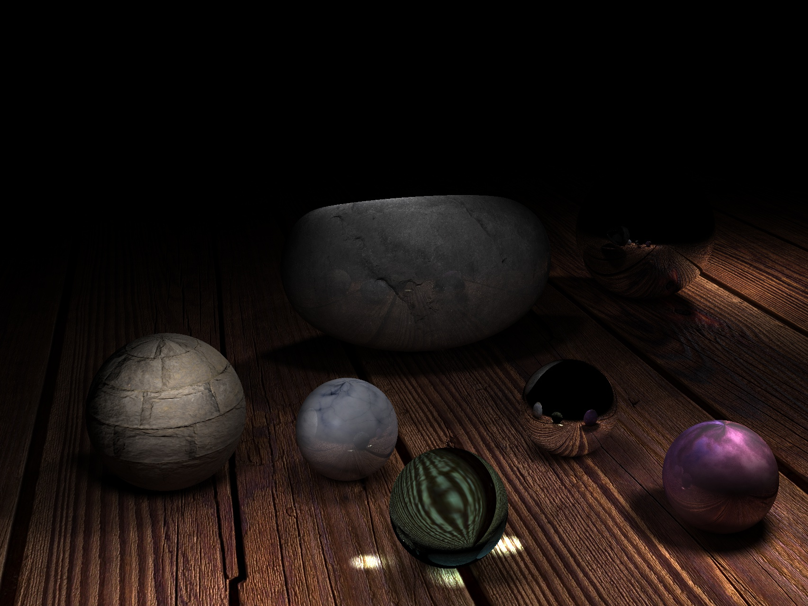
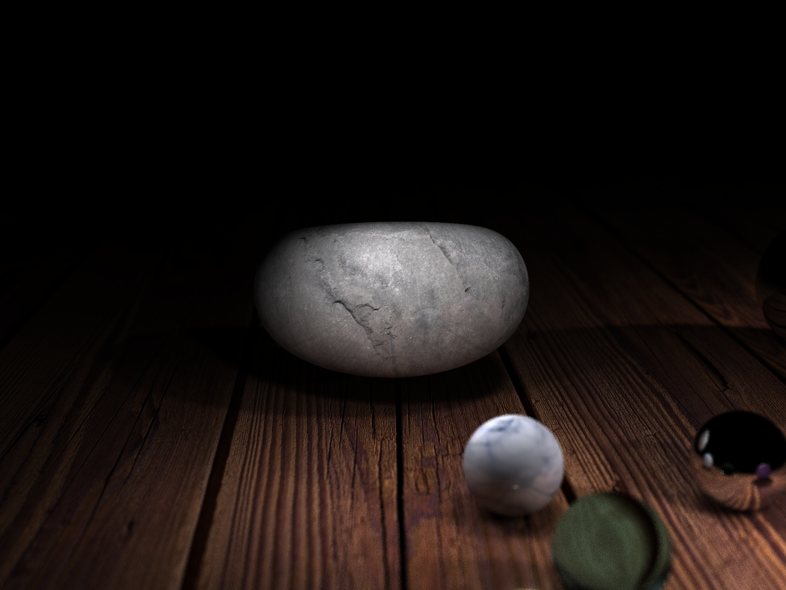

# PPM

A realistic 3D renderer with bezier surface models using PPM(Progressive Photon Mapping).

Big Assignment for Computer Graphics course, 2018 Spring

## Final Images

Demonstration of Depth of field(景深)

## Run

1. > cd src/build

2. > cmake ..

3. > make

4. > cp ./PhotonMapping <targetDirectory>

5. > cd <targetDirectory>

6. > ./PhotonMapping

ps.程序中设定的openmp线程数为48，如需修改请在Renderer.cpp中修改